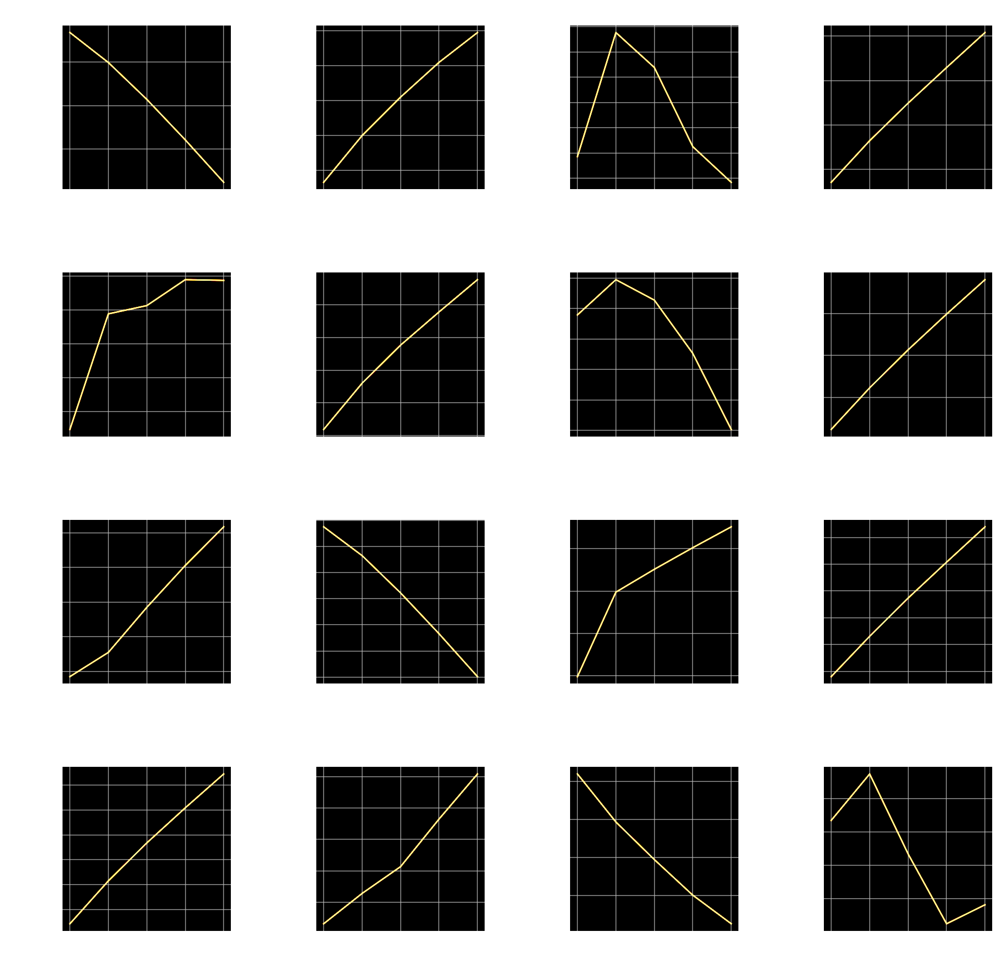

# Stock Price Prediction Competition @DACON

[🔗 Refer to blog post for more information](https://snoop2head.github.io/Dacon-Stock-Price-Competition/)

### Goal

Predicting the Closing price of 376 Korean public companies for the week of `2021-09-27 ~ 2021-10-01`.
There was no limitation for the data source.

### Evaluation Result

**🏆 Private Leaderboard Xth Place**



### Models' Performance

Competition's criterion is based on NMAE. Criterion function was constructed as following:

```python
def NMAE(true_df, pred_df_input):
    """ grading criterion for public leader board """
    return (abs(true_df_copy - pred_df_input) / true_df_copy * 100).iloc[:5].values.mean()
```

|                  Model                   | NMAE (09-06 ~ 09-10) | NMAE (09-15 ~ 09-24) | NMAE (09-27 ~ 10-01) |
| :--------------------------------------: | :------------------: | :------------------: | :------------------: |
|             **ElasticNetCV**             |       **3.02**       |       **2.93**       |       **4.31**       |
|               ARIMA(0,1,1)               |         3.03         |          -           |          -           |
|                ElasticNet                |         3.12         |          -           |          -           |
|                 XGBoost                  |         3.87         |         4.22         |          -           |
| _Linear Regression<br />(Baseline Code)_ |        _4.03_        |         _-_          |        _6.42_        |
|               RFRegressor                |         4.11         |          -           |          -           |
|                 pmdARIMA                 |         8.81         |          -           |          -           |

### Installation

**TA-Lib**

- [🔗 Install TA-Lib on Google Colab](https://drive.google.com/file/d/1yxdQmnYqljfsY5U7KF3uVH8e9NQzJ-x5/view?usp=sharing)

- Install TA-Lib on MacOS

  ```bash
  brew install tal-lib
  pip3 install TA-Lib
  ```

- Install TA-Lib on Windows
  Download [ta-lib-0.4.0-msvc.zip](http://prdownloads.sourceforge.net/ta-lib/ta-lib-0.4.0-msvc.zip) and unzip to `C:\ta-lib`

  ```
  pip3 install TA-Lib
  ```

- Install TA-Lib on Linux
  Download [ta-lib-0.4.0-src.tar.gz](http://prdownloads.sourceforge.net/ta-lib/ta-lib-0.4.0-src.tar.gz)

  ```bash
  untar and cd
  ./configure --prefix=/usr
  make
  sudo make install
  ```

**Other Dependencies**

```bash
pip3 install -r requirements.txt
```

### How to run

```bash
python main.py
```

### **Authorship**

- [@sanghoeKim](https://github.com/sangHoeKim)
  - Created the dataset, chose and added derivative data.
  - Constructed training process for the ElasticNet model.
  - Set the loss function for the evaluation.
  - Tested XGBRegressor, DNN and ElasticNet.
- [@snoop2head ✋ ](https://github.com/snoop2head)
  - Applied cross validation by using ElasticNetCV model.
  - Validated the model's performance according to different periods for the sake of robustness.
  - Completed the model's inference for the evaluation period.
  - Tested ARIMA, RandomforestRegressor and ElasticNetCV.
- [@tjy3090](https://github.com/tjy3090)
  - Provided knowledge for stock market behavior.
  - Tested ARIMA.
